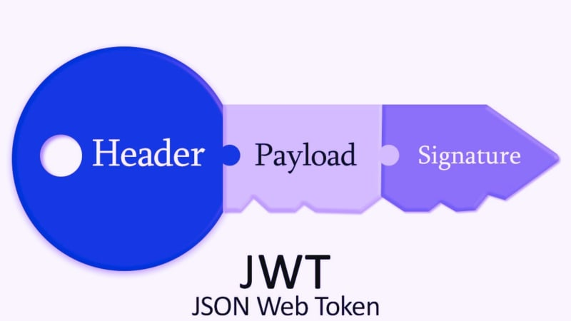
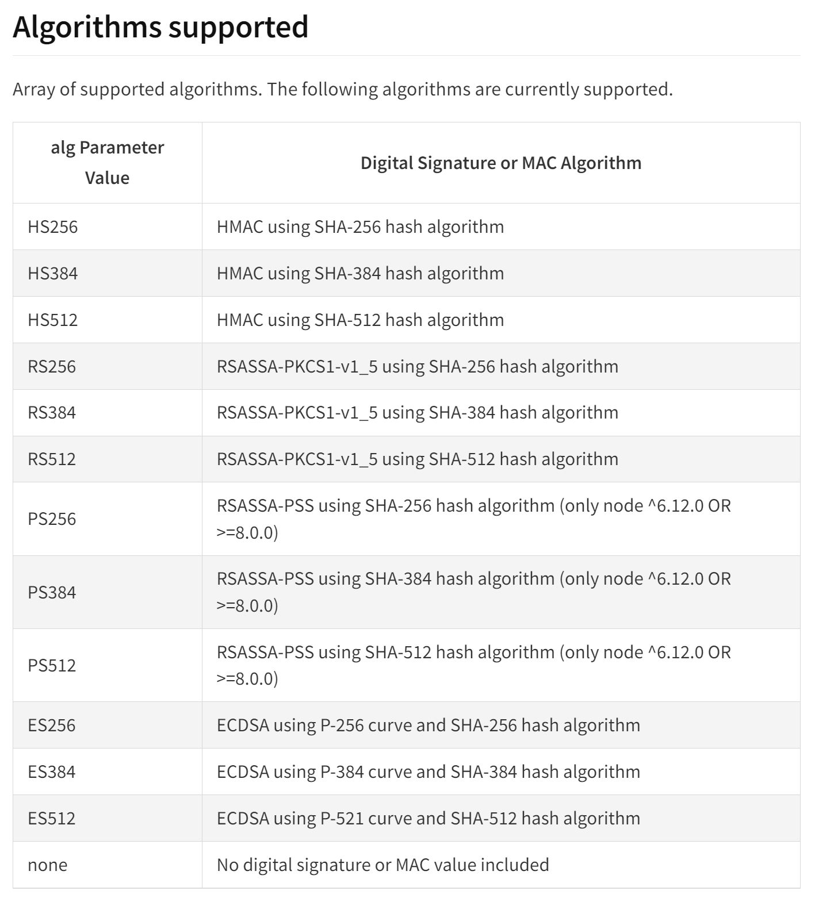
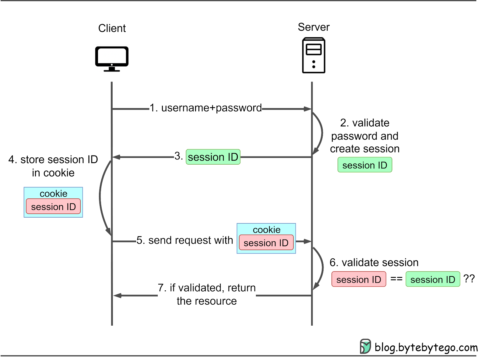
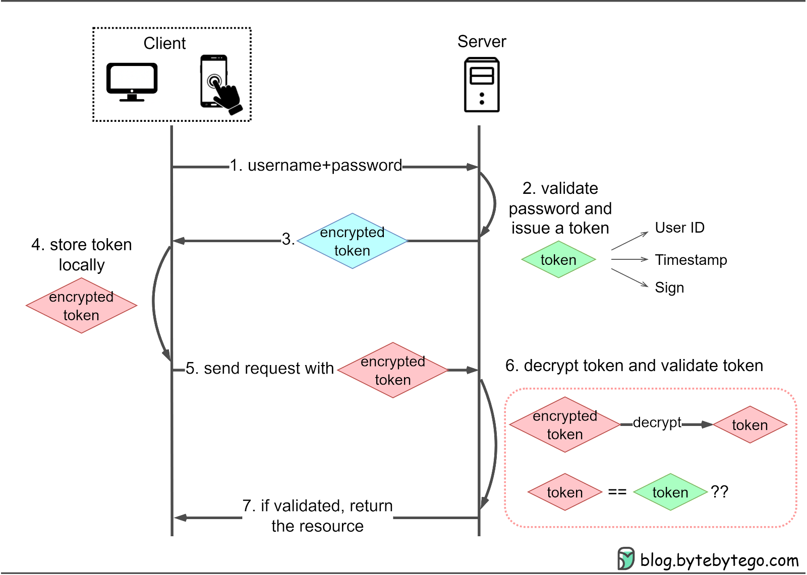

# Build An Authorization System With JWT

## Authentification and Authorization
### Authentification
Authentification is the process or action of verifying the identity of a user or process

### Authorization
Authentification is the process or action of verifying a user's or a process' permissions or level of access

## JWT (JSON Web Token)  
JSON Web Token (JWT) is an open standard (RFC 7519) that defines a compact and self-contained way for securely transmitting information between parties as a JSON object. This information can be verified and trusted because it is digitally signed.

### structure


**Header**: Describes the token, specifying the type and signing algorithm.
Example: {"alg": "HS256", "typ": "JWT"}

**Payload**: Contains claims, statements about the user or additional data.
Example: {"sub": "1234567890", "name": "John Doe", "iat": 1516239022}

**Signature**: Created by combining the encoded Header, encoded Payload, and a secret key, using the specified signing algorithm.

check [jwt.io](https://jwt.io/) 

#### Encoding vs Hashing
**Encoding** is a technique where the data is transformed from one form to another in a way that can be reversed.

**Hashing** is a technique where the data is transformed from one form to another in a way that can't be reversed.

### Different type of hasing algorithms supported: 
 
**_NOTE:_**  These Algorithms are only the one supported in the **jsonwebtoken** node package

## Session Auth vs Token Auth



Without the need to store session information on the server, token-based authentication reduces the server load and database queries associated with session management.

## Access and Refresh Token
**Access token**: a JWT that allow users to access sensitive information without repeated login requests. Access tokens usually have very short lifespans.

**Refresh Token**: a JWT issued alongside access token, allowing additional access tokens to be granted when the live access token expires. Refresh tokens usually have a longer lifespans and need to be stored securely.

## Getting Started

1. initiate your project:
    ```bash
    npm init -y
    ```

2. Install dependencies:

   ```bash
   npm install express nodemon dotenv jsonwebtoken
   ```

3. Create a `.env` file in the root directory and add your environment variables:

   ```env
   PORT=3000
   JWT_SECRET=MYSECRETKEY
   ```

4. Configure your script in your **package.json** file:

   ```env
   ...
   "scripts": {
        "dev": "nodemon app.js"
        ...
    },
    ...
   ```

5. Run the application:

   ```bash
   npm run dev
   ```

   The server will be running at `http://localhost:3000`.

### Usage
We'll be mainly using two functions :
- **jwt.sign(payload, secretOrPrivateKey, [options, callback])** used to generate the jwt

- **jwt.verify(token, secretOrPublicKey, [options, callback])** used to verify the jwt

**sign(payload, secretOrPrivateKey, [options, callback])**:
the function accepte 2 required parameters and 2 other optional depending on the context:
- payload: represent the data in form of a jadon object
- options: 
    - algorithm (default: *HS256*)
    - header
    - expiresIn: expressed in seconds or a string describing a time span [vercel/ms](https://github.com/vercel/ms); eg: _60_, _"2 days"_, _"10h"_, _"7d"_

Generated jwts will include an **iat** (issued at) claim by default

```js
var jwt = require('jsonwebtoken');
var accessToken = jwt.sign({ foo: 'bar' }, 'shhhhh', { expiresIn: '1h' });
```
or
```js
var jwt = require('jsonwebtoken');
var accessToken;
jwt.sign({ foo: 'bar' }, privateKey, { algorithm: 'RS256' }, function(err, token) {
  accessToken = token;
});
```

**verify(token, secretOrPublicKey, [options, callback])**:
like **sign** function, it accepts two required parameters and two other optional based on the context
**options** are slightly different then the one in **sign** so it's better to check the [documentation](https://www.npmjs.com/package/jsonwebtoken#algorithms-supported) for more infos 
```js
try {
  var decodedPayload = jwt.verify(token, 'wrong-secret');
} catch(err) {
  // err
}
```
```js
var decodedPayload;
jwt.verify(token, 'shhhhh', function(err, decoded) {
  ...
  decodedPayload = decoded
});
```


